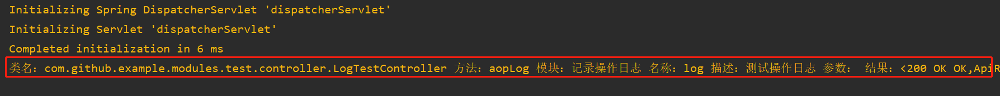
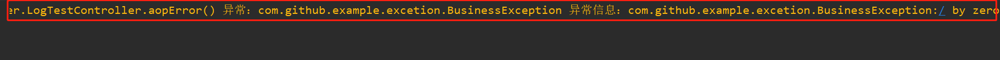

# Spring Boot Aop记录日志

## 介绍

该案例实现使用Aop的方式记录请求日志，包含信息（类名、方法名、请求参数和返回结果等），且记录详细的异常信息

## 目标

1、实现记录操作日志和异常日志

2、发现错误及时排查

## 图示

**正常记录操作日志**

$$
类名：com.github.example.modules.test.controller.LogTestController 方法：aopLog 模块：记录操作日志 名称：log 描述：测试操作日志 参数： 结果：<200 OK OK,ApiResult(code=200, message=aopLog, data=null),[]>
$$

**记录错误日志**

$$
类名：com.github.example.modules.test.controller.LogTestController 方法：public org.springframework.http.ResponseEntity com.github.example.modules.test.controller.LogTestController.aopError() 
异常：com.github.example.excetion.BusinessException 
异常信息：com.github.example.excetion.BusinessException:/ by zero
$$

------

### 参考

博客：https://www.cnblogs.com/wm-dv/p/11735828.html

项目：https://github.com/wsq5494/LogExceptionDemo
